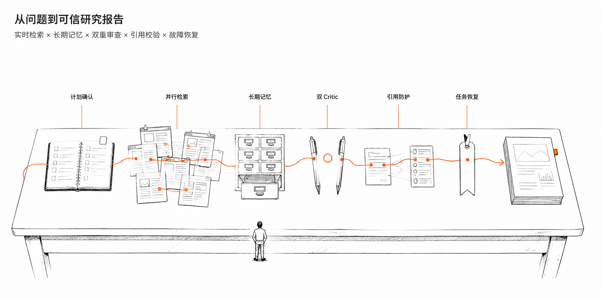
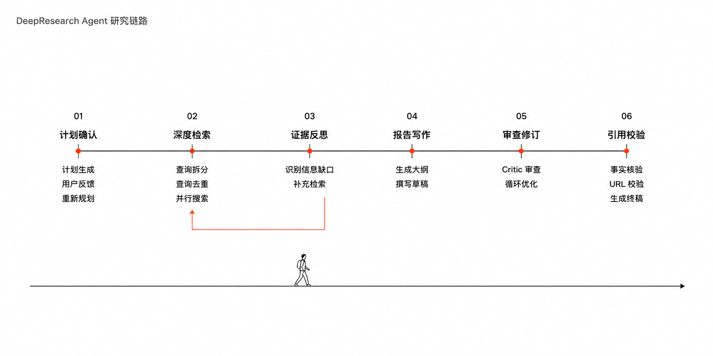
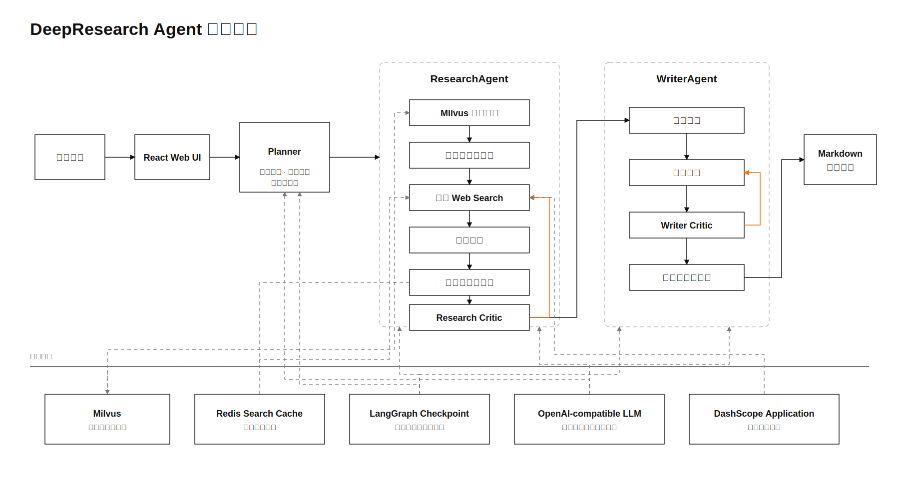

<h1 align="center">🔬 DeepResearch</h1>

<p align="center">
  <strong>基于 LangGraph 的多阶段深度研究 Agent</strong><br>
  <sub>融合实时网络检索、事实级长期记忆、双重 Critic 审查与可追溯引用</sub>
</p>

<p align="center">
  <a href="#-项目亮点">项目亮点</a> ·
  <a href="#-研究链路">研究链路</a> ·
  <a href="#-系统架构">系统架构</a> ·
  <a href="#-快速开始">快速开始</a> ·
  <a href="#-工程验证">工程验证</a> ·
  <a href="#-项目结构">项目结构</a>
</p>

<p align="center">
  
  
  
  
  
  
</p>

<p align="center">
  <strong>计划确认</strong> → <strong>深度检索</strong> → <strong>证据反思</strong> → <strong>报告写作</strong> → <strong>审查修订</strong> → <strong>引用校验</strong>
</p>

<p align="center">
  
  <br>
  <sub>可视化展示研究计划、检索过程、Agent 状态与最终报告</sub>
</p>

---

## ✨ 项目亮点



| 🧭 **计划确认** | 🔎 **并行深度检索** |
|---|---|
| 支持用户确认、反馈与重新规划，再进入正式研究。 | 自动拆分问题、去重查询、并行搜索，并由 Research Critic 判断是否补充证据。 |
| 🧠 **事实级长期记忆** | ✍️ **Writer/Critic 循环** |
| 从 Milvus 召回历史事实，并将新事实写回长期记忆。 | 依次生成大纲、草稿、审查意见和终稿，按反馈迭代修订。 |
| 🛡️ **事实与引用防护** | ♻️ **Checkpoint 恢复** |
| 校验章节、专名和 URL，拒绝未知链接与截断终稿。 | 使用稳定 `thread_id` 恢复任务，避免重复外部搜索。 |
| 📊 **可复现评测** | 🖥️ **可视化交互** |
| 提供固定题集、LLM-as-Judge、A/B 与故障注入测试。 | React 前端展示计划、研究过程、状态和最终报告。 |

> 本项目采用事实级 Memory-Augmented RAG，而不是传统的上传文档问答 RAG。Milvus 保存提取后的事实记录，Redis 分别承担搜索缓存与任务 Checkpoint。

---

## 🔄 研究链路



---

## 🏗️ 系统架构



### 核心数据边界

- **Milvus**：跨任务长期事实记忆与语义召回。
- **Redis Search Cache**：短期缓存网页搜索结果，减少重复外部调用。
- **LangGraph Checkpoint**：保存任务图状态，用于失败恢复和任务续跑。

---

## 🧰 技术栈

| 模块 | 技术 |
|---|---|
| Agent 编排 | LangGraph、LangChain |
| 后端 | Python 3.11+、FastAPI、LangGraph API |
| 模型接入 | OpenAI-compatible API、DashScope Application |
| 长期记忆 | Milvus、PyMilvus、Embedding API |
| 缓存与恢复 | Redis、langgraph-checkpoint-redis |
| 前端 | React 19、TypeScript、Vite、Tailwind CSS |
| 评测 | Pytest、LLM-as-Judge、固定题集 A/B Benchmark |

---

## 🚀 快速开始

### 环境要求

- Python `3.11+`
- Node.js `18+`
- Docker 与 Docker Compose
- OpenAI-compatible LLM 和 Embedding 服务
- DashScope Application/MCP Web Search 配置

### 1. 安装依赖

进入项目根目录后执行：

```bash
python3.11 -m venv .venv
source .venv/bin/activate
python -m pip install --upgrade pip
python -m pip install -e "backend[dev]"

cd frontend
npm ci
cd ..
```

### 2. 启动 Milvus 与 Redis

```bash
docker compose -f infrastructure/milvus/docker-compose.yml up -d
docker run -d --name deepresearch-redis -p 6379:6379 redis:7-alpine
```

如果本机已有 Redis，可跳过第二条命令。

### 3. 配置环境变量

创建 `backend/.env`，并替换以下配置：

```dotenv
# 研究模型 / 推理模型
RESEARCH_LLM_MODEL=your-research-model
RESEARCH_LLM_API_KEY=your-api-key
RESEARCH_LLM_BASE_URL=https://your-llm-endpoint/v1

REASONING_LLM_MODEL=your-reasoning-model
REASONING_LLM_API_KEY=your-api-key
REASONING_LLM_BASE_URL=https://your-llm-endpoint/v1

# DashScope 应用与网页搜索
MCP_API_KEY=your-dashscope-api-key
MCP_APP_ID=your-web-search-application-id

# Redis 搜索缓存与任务检查点
REDIS_URL=redis://localhost:6379/0
CHECKPOINT_BACKEND=redis
CHECKPOINT_REDIS_URL=redis://localhost:6379/0

# Milvus 事实记忆
MILVUS_URI=http://localhost:19530
MILVUS_COLLECTION=research_facts

# OpenAI 兼容的向量嵌入服务
EMBEDDING_BASE_URL=https://your-embedding-endpoint/v1
EMBEDDING_API_KEY=your-embedding-api-key
EMBEDDING_MODEL=text-embedding-v3
EMBEDDING_DIM=1024
```

> `EMBEDDING_DIM` 必须与 Embedding 模型的实际输出维度及 Milvus Collection 维度一致。

### 4. 启动应用

分别在两个终端运行：

```bash
# 终端 1：启动 LangGraph 后端
./run_backend.sh
```

```bash
# 终端 2：启动 React 前端
./run_frontend.sh
```

默认地址：

- 🌐 Web UI: [http://localhost:5173](http://localhost:5173)
- 🔗 LangGraph API: [http://localhost:2024](http://localhost:2024)
- 🧩 LangGraph Studio: [https://smith.langchain.com/studio/?baseUrl=http://127.0.0.1:2024](https://smith.langchain.com/studio/?baseUrl=http://127.0.0.1:2024)

---

## 📊 工程验证

项目保留固定题集、原始 JSON 结果和评测报告。以下结果只代表对应实验范围，不外推为通用生产指标。

| 验证项 | 结果 | 说明 |
|---|---|---|
| 查询去重 A/B | 状态查询重复率 `50% → 0%` | 10 个固定主题均成功完成；平均状态查询数 `6 → 3` |
| Checkpoint 故障恢复 | Web Search 调用 `6 → 3` | Critique 节点故障后恢复，最终执行查询数保持为 3 |
| Prompt Quality Guards | 幻觉题数 `3/5 → 0/5` | 事实约束增强，但固定集均分 `4.36 → 4.24`，综合质量仍需优化 |

详细报告：

- [查询去重 Benchmark](./docs/reviews/2026-06-16-agent-harness-benchmark.md)
- [Checkpoint Resume Benchmark](./docs/reviews/2026-06-16-agent-checkpoint-resume-benchmark.md)
- [Prompt Quality Guards E2E A/B](./docs/reviews/2026-06-18-prompt-quality-guards-e2e-ab.md)

### 运行测试与评测

```bash
cd backend

# 单元测试与回归测试
../.venv/bin/python -m pytest

# 固定题集端到端与组件级评测
../.venv/bin/python -m eval.run_eval \
  --mode all \
  --test-set test_set_basic_5.json \
  --output eval_runs/local_eval.json

# 查询去重 A/B 基准测试
../.venv/bin/python -m eval.run_benchmark --variant both

# Checkpoint 故障注入基准测试
../.venv/bin/python -m eval.run_resume_benchmark
```

> 端到端评测会调用真实 LLM、Web Search 和 Milvus。运行前请检查服务连通性、API 配额，并为评测使用独立的 Milvus Collection。

---

## 📁 项目结构

```text
DeepResearch/
├── backend/
│   ├── src/agent/
│   │   ├── graph.py                 # 主图：计划、研究、写作
│   │   ├── checkpoint.py            # Redis/Memory Checkpoint
│   │   ├── resume.py                # 任务恢复辅助接口
│   │   ├── sub_agents/
│   │   │   ├── research_agent.py    # 查询、检索、事实记忆、反思
│   │   │   └── writer_agent.py      # 大纲、草稿、审查、终稿
│   │   ├── kb/                       # Milvus 事实存储与生命周期
│   │   ├── search_cache.py          # Redis 搜索缓存
│   │   └── llm/llm.py               # OpenAI-compatible LLM
│   ├── eval/                         # 评测框架与 Benchmark
│   ├── eval_runs/                    # 固定集原始结果
│   └── test/                         # 单元与回归测试
├── frontend/                         # React + Vite Web UI
├── infrastructure/milvus/            # Milvus Docker Compose
├── docs/
│   ├── assets/                       # README 图片与架构图
│   └── reviews/                      # 工程验证报告
├── run_backend.sh
└── run_frontend.sh
```

---

## 🎯 示例研究问题

```text
规范驱动开发（SDD）与 AGENTS.md 的关系是什么？
请结合工程实践、工具链、风险和真实案例生成一份带来源引用的研究报告。
```

---

## ⚠️ 当前边界

- Web Search 当前依赖 DashScope Application/MCP 配置。
- Milvus 保存提取后的事实记录，不保存原始文档 Chunk。
- Prompt Quality Guards 已增强事实约束，但覆盖度、时效性和来源分级仍需继续优化。
- 生产部署前需要补充鉴权、密钥管理、监控和更严格的安全策略。
