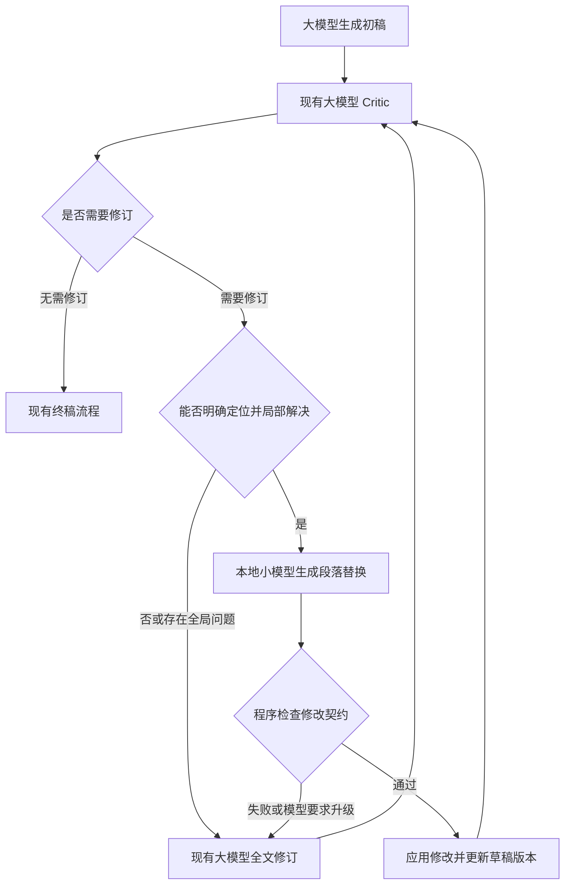

# 再次审查：本地小模型承担 Writer 局部修订

日期：2026-09-14。用户目标保持为降低推理费用和等待时间；硬件为本机 M4 Pro、24 GiB 统一内存。本次重新检查 Writer 循环、提示词、状态、预算、评测产物与测试，使用离线 mock 验证真实图路径。没有调用付费模型，没有训练或修改业务代码。

## 本轮结论

更值得验证的方案是：在大模型 Critic 已定位问题后，由本地小模型根据证据修改指定段落；程序应用修改，然后继续由现有大模型 Critic 审查。初稿、全局推理和大范围改写继续使用大模型。

目标接入点为 `writer_agent.py` 的 `_route_after_critic()` → `_draft()` 修订分支。需要新增局部修订路径，而不是简单把整个 Writer/Critic 换成小模型。

这是有代码依据的待验证方案，不是已证明的最佳方案。它优于前几轮候选的潜在之处，在于能用短输入、短输出替代一次完整长报告重生成。它的实际价值取决于真实任务是否经常进入修订，以及修订问题中有多少可以局部解决。当前历史产物没有足够数据计算这两个比例。

## 新核实的证据

### 1. 局部修改也走全文生成

[_draft()](/Users/liuwenhao/Documents/DeepResearch/backend/src/agent/sub_agents/writer_agent.py:157)在 `critic_feedback` 非空时进入修订模式，但调用仍同时传入全部摘要、来源清单、完整上一版草稿，并要求输出完整报告。

离线复现给出一条“只改章节二的一处表述”的意见和 4,827 字符的演示草稿，实际调用依然携带全部草稿与全部摘要。该复现验证了请求构造，不代表模型生成性能。

### 2. Writer 的重复调用是真实图路径

用 mock 替换模型边界、运行现有 `writer_agent_graph.ainvoke()`，得到：

| 审稿情形 | 大纲 | 草稿/全量修订 | Critic | 润色 | 合计 |
|---|---:|---:|---:|---:|---:|
| 首次审稿通过 | 1 | 1 | 1 | 1 | 4 |
| 修订 3 次后通过 | 1 | 4 | 4 | 1 | 10 |

不考虑超时重试、缺章补全和预算提前终止时，Writer 模型调用数为 `4 + 2r`，其中 `r` 为实际修订次数。完整报告输出次数为 `r + 2`（初稿、每次修订、最终润色）。这是结构和 mock 路径统计，不能理解为线上每次都发生 3 轮修订。

### 3. 历史报告确实较长，但不能据此编造成本占比

直接读取历史 JSON 的 `report` 并用 Python `len()` 计数：

| 产物 | n | 平均字符数 | 范围 |
|---|---:|---:|---:|
| `e2e_baseline_basic5_v1.json` | 5 | 9,257 | 7,348–10,559 |
| `e2e_guardfix_basic5_v3.json` | 5 | 10,675 | 7,931–15,020 |

字符数包括 Markdown，不是 token 数；统计对象是终稿，不是每一轮草稿。这支持“全文输出规模不小”，不支持“Writer 占总费用的某个百分比”。

另外，`benchmark_report_20260616.json` 明确标注 `run_mode=research-only`，其时延与调用数不能用来证明 Writer 性能。上述历史 E2E JSON 只有终稿、来源和评分等字段，没有逐轮草稿、Critic issues 或角色耗时；当前 `E2EResult` 也没有完整的逐轮编辑账本。

### 4. 无局部改写协议，现有结构化意见被展开为文本

[Issue](/Users/liuwenhao/Documents/DeepResearch/backend/src/agent/tools_and_schemas.py:39)包含 severity、location、problem、suggestion，但 location 是自由文本。[Critic 节点](/Users/liuwenhao/Documents/DeepResearch/backend/src/agent/sub_agents/writer_agent.py:277)把 issues 格式化为 `critic_feedback`，没有把完整结构化 issues 保存在独立 state 字段。

要让小模型精确执行修改，必须补上稳定的段落标识、问题对应原句、允许使用的证据。不能把“第 2 节写得不好”直接交给小模型，再期望它自行定位与重构全文。

### 5. 全文润色不能直接删除

[_cite_and_polish()](/Users/liuwenhao/Documents/DeepResearch/backend/src/agent/sub_agents/writer_agent.py:711)不仅调整语言，还接收最后一次 Critic 反馈，负责处理遗留事实问题。[路由](/Users/liuwenhao/Documents/DeepResearch/backend/src/agent/sub_agents/writer_agent.py:335)在修订次数耗尽、审稿仍不通过时，也会进入该节点。

因此必须保留当前润色作为第一轮对照中的一致条件。未来如测试跳过润色，应要求没有未解决的严重问题，并用程序化 `_finalize_report()` 保留引用整理；跳过润色是独立实验，不算微调带来的收益。

## 拟议流程



局部修订和全文修订均消耗同一任务的修订预算；本地失败后再使用大模型不能获得额外无限循环。调用、失败和等待时间都计入预算。第一版保留大模型全篇复审，不预先假定小模型可以自证事实正确。

## 小模型的职责边界

| 适合局部处理 | 应回退到现有大模型或继续研究 |
|---|---|
| 证据明确但把“预测”写成“已经发生” | 证据不足，需要补搜后才能下结论 |
| 某一实体、日期、数值或限定条件误抄，正确值有明确证据 | 多来源口径冲突，涉及整篇论证取舍 |
| 把第三方来源写成官方，来源元信息足以明确修正 | 缺失整章、需要重构报告大纲 |
| 指定段落中的冗余、含糊表达，且不改变事实 | 修改一处会影响多个章节、表格或最终结论 |
| 已明确要求降格或删去无依据断言，且不破坏章节覆盖 | 无法唯一定位原文、Critic 意见本身可疑 |

这里的小模型是“执行已给定修改任务的编辑器”。它不是全文质量裁判，也不负责从自己的记忆里查正确答案。即使输入只有一个段落，也可能需要全局语境；无法证明适合局部处理时就升级，不强行截断。

首次试验只处理明确定位、彼此独立的局部问题。混有全局问题时整轮回退现有修订路径，避免同时做局部和全文修订却没有节省调用。格式、链接替换等可由确定性代码完成的内容，继续由代码处理。

## 输入、输出和长文问题

拟议输入：目标段落、必要的相邻段落/章节说明、结构化修改意见、对应的少量证据片段、来源编号、草稿版本号。并非把整个报告切开后所有段落都跑一次模型，只处理已有明确问题的段落。

示例（虚构内容，用于说明协议）：

```text
原句：该产品已经在 2025 年全面商用。
证据：公司在 2025 年公告中表示，预计于 2026 年开放商用。
审稿意见：将预测表述写成了已发生事实；保留预测性质和时间。
允许修改：p12 段落，其他内容保持原样。
```

```json
{
  "action": "replace",
  "block_id": "p12",
  "replacement": "公司在 2025 年公告中表示，该产品预计于 2026 年开放商用。",
  "evidence_ids": ["e3"]
}
```

协议还要支持 `keep` 与 `escalate`，防止为了完成任务硬改正确内容或猜测答案。`base_revision`、原文 hash/精确匹配由请求与程序共同绑定。来源 URL 由程序从受控编号恢复，避免训练模型抄长链接。

第一版只允许替换一个明确的段落块；表格、代码块、复杂列表和跨段引用另行处理，不能用简单换行切分破坏 Markdown。应用修改前检查草稿版本与原文是否仍匹配。未修改块必须逐字保留，修改后仍执行完整章节/引用契约校验。

真正的事实支持不能只靠字符串匹配验证。程序可验证定位、来源集合、格式和修改范围；修改是否正确、是否引入矛盾，交给保留的大模型复审与人工抽检。Critic 也可能误判，因此训练标签需审核。

## 为什么值得为它微调

训练目标具体且可以局部验收：修改指出的问题、保留正确内容、保留引用、不给证据补戏、不越过编辑范围、不能修时升级。

同一个普通模型可能习惯改写整段、添加解释或扩写。专门微调可针对这些实际失败学习最小修改策略。相关研究已探索基于证据修正断言和生成后编辑，但论文结果不能外推为本项目中文报告或本机 4B 模型的效果。[Evidence-based Factual Error Correction](https://aclanthology.org/2021.acl-long.256/)、[FactEdit](https://aclanthology.org/2022.emnlp-main.667/)。

候选仍可沿用首轮审查中的 4B 量化指令模型和 MLX LoRA，先固定一个基座对比原版与微调版，不因换任务而不断追逐新型号。推荐模型尚未下载或实测。

训练数据来自审核过的 `(原段落, 审稿意见, 证据, 正确替换或升级)`，包含正确文本不应修改、错误审稿意见、证据不足、冲突证据以及需要全局改写的负例。按报告、来源和实体事件分组划分训练/验证/测试；同一报告的相邻段落不能随机分散到不同集合。

现有 E2E 终稿不是现成编辑对；现有 39 条 guard 语料主要检验规则，也不是充分训练数据。先采集独立的逐轮编辑记录，再筛选。合成数字/年份错误可用于补充，但不能让训练和测试都只由相同替换模板生成。训练规模由首轮错误分布和学习曲线决定，不预先声称几百条必然足够。

## 必须用四组比较，避免把流程收益归功于微调

| 组 | 修订方式 | 目的 |
|---|---|---|
| A | 当前大模型全文修订 | 原始基线 |
| B | 同一个大模型只生成局部修改 | 测量缩小修改范围的收益 |
| C | 本地原版小模型生成同样的局部修改 | 测量本地小模型替换收益 |
| D | 本地微调小模型生成同样的局部修改 | 测量微调的额外收益 |

四组使用相同的草稿、已知问题、证据和验收方式；保留一致的全篇 Critic 和润色策略。若 B 已显著优于 A 而 C/D 更慢或质量更差，就采用 B，不为了本地化强行上线。若 C 已满足要求，D 没有必要。

先准备约 100 个审核后的编辑案例，包含局部可修、无需修改、需升级三类。这是起步实验建议，不是充分统计保证。本次未生成或调用教师模型制作这些案例。

重点指标：

- 修订意见实际解决率；每次修改后的新增事实错误率。
- 正确内容误改率、被删除有效信息、引用归属与章节覆盖。
- 小模型升级/失败比例，以及升级后的大模型费用和等待时间。
- 本地冷/热运行、排队与峰值内存；局部 edits 多时的累计耗时。
- 修改后全篇 Critic 的通过率、总修订轮数和最终报告质量。
- 整个任务的总费用与总完成时间，不能只统计被替换的一次调用。

成本收益条件为：被替代的全文修订费用，大于本地编辑、必要证据定位、失败升级和额外复审的总费用。时延需要独立计算，不能用费用替代时延。

报告若经常一次通过，或者大多数问题都需要全局重写，这个方案的收益就很小。此时应优先测量/优化固定执行的终稿步骤，而不是继续寻找一个听起来合理的小模型位置。

## 实现涉及的最小边界（仅设计，未修改）

| 现有位置 | 必要改动 |
|---|---|
| `tools_and_schemas.py` | 增加可定位的 issue/patch 协议；区分局部问题与全局问题 |
| `state.py` | 保存结构化 issues、草稿版本及受预算约束的编辑状态 |
| `_critic_review()` | 在现有审稿调用中返回段落编号/原句，保留结构化结果；避免另加一次模型做定位 |
| `_route_after_critic()` | 满足局部修订条件时进入本地编辑；否则保持原路径 |
| 新局部编辑节点与程序校验 | 构造受控上下文，应用准确匹配的替换，失败升级 |
| `_draft()` | 继续生成初稿、处理全局修订和回退 |
| `configuration.py` / `llm.py` | 独立编辑角色、本机端点、超时、输出限制与逐次用量 |
| `eval/` | 编辑对回放与四组消融，保留失败、升级和无修改案例 |

证据优先取已有引用对应的原始检索片段；当前 state 主要保存摘要，若只能拿到摘要，必须把评估口径写成“相对摘要的保真修订”，不能声称完成原网页事实核验。真正的原文验证需要补齐受控的来源片段存储。

这轮的建议依据比“某个节点输出短，所以适合小模型”更具体：项目确实存在局部问题触发全文重生成的路径。但是否值得实施，仍应由真实修订分布和上述四组实验决定。
