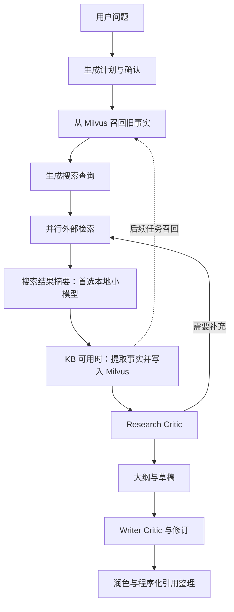

# 本机小模型接入与微调审查

审查日期：2026-09-14。审查基于 `eada33a` 及当前工作区（包含用户尚未提交的检索改动）。目标：降低推理成本和等待时间，在用户电脑本地运行小模型。

> 后续复审：用户进一步要求避开收益有限或依赖长上下文的替换点。本报告保留首轮分析；当前优先验证方案改为 [Writer 局部修订模型](/Users/liuwenhao/Documents/DeepResearch/docs/reviews/2026-09-14-local-revision-model-review.md)。它针对全文反复生成的结构性开销，但尚未实测本机收益，也不意味着摘要方案已被实验否定。

## 结论

首选接入点是 `ResearchAgent._web_search()` 中的搜索结果摘要调用。先用原版量化小模型替换这一处，保持原有摘要与引用协议，通过固定输入回放判断速度和质量；只有出现稳定、可标注的保真度或格式问题时才做微调。

建议首个候选为 `Qwen3-4B-Instruct-2507` 的 4-bit 版本。它是本次选择的实验基线，不是“当前最强”结论。训练优先采用 MLX LM 的量化 LoRA；完成后继续使用 MLX 服务，减少适配器转换变量。已有 Ollama 可用于原版模型基线实验。

第二阶段才考虑让同一次模型调用同时输出摘要和结构化事实，省掉当前串行的 `FactExtractor` 调用。不要第一轮就同时迁移规划、摘要、Critic 和 Writer，否则难以归因效果。

“本地化降低云端调用费用”与“本地化缩短等待时间”必须分别验证。微调本身不保证提速；相同模型、相近输入输出长度下，主要收益通常是任务质量、格式稳定性和更少的重试。这个项目的长报告撰写、审查和网络检索仍可能决定总耗时。

## 本机条件与验证范围

- 实测硬件：Apple M4 Pro，14 核 CPU、20 核 GPU、24 GiB 统一内存。
- 检查时磁盘可用约 101 GiB；这是快照，不是可全部分配给训练的预算。
- Ollama 已安装；模型列表为 `qwen2.5vl:3b`、`bge-m3:latest`；检查时没有驻留模型。
- 上述两个现有模型分别是多模态模型与嵌入模型，不是本次建议的文本摘要基线。
- 4B/4-bit 是基于硬件的可行性判断，尚未下载、加载或实测推荐模型。4B 权重按每参数 4 bit 粗算约 2 GB，但实际占用还包含量化元数据、KV cache、激活、训练状态、系统与其他服务，不能把 2 GB 当运行内存需求。
- 7B/8B 量化推理可以列为后续比较对象；考虑 24 GiB 与速度目标，首轮不从更大模型、全参数训练或超长上下文开始。
- 本次未运行付费 E2E、真实搜索评测、训练或模型推理；没有修改业务代码、模型配置及用户数据。

## 实际调用链



KB 不可用时 G 跳过，研究继续。当前任务的 Critic 和 Writer 消费 `web_search_result` 摘要；刚提取的 facts 不直接进入本轮 Writer 输入。因此只优化 FactExtractor，不能直接声称改善当前报告内容。

| 环节 | 代码位置 | 当前模型选择 | 对本次目标的判断 |
|---|---|---|---|
| 计划生成/确认 | [graph.py](/Users/liuwenhao/Documents/DeepResearch/backend/src/agent/graph.py:65) | `query_generator_model` | 次优；调用相对少，确认部分已有规则捷径 |
| 初始查询生成 | [research_agent.py](/Users/liuwenhao/Documents/DeepResearch/backend/src/agent/sub_agents/research_agent.py:397) | `query_generator_model` | 可作为后续替换；输出短，但查询失误会增加搜索与后续推理 |
| 每个查询的结果摘要 | [research_agent.py](/Users/liuwenhao/Documents/DeepResearch/backend/src/agent/sub_agents/research_agent.py:578) | `query_generator_model` | 第一优先；每次非空搜索结果都会执行，任务边界明确 |
| 从摘要提取事实 | [extractor.py](/Users/liuwenhao/Documents/DeepResearch/backend/src/agent/kb/extractor.py:75) | 独立 `FACT_EXTRACTOR_MODEL` | 最容易独立替换；仅 KB 可用时执行，后续适合与摘要合并 |
| Research Critic | [research_agent.py](/Users/liuwenhao/Documents/DeepResearch/backend/src/agent/sub_agents/research_agent.py:657) | state 中的 `reasoning_model` 优先 | 首轮保留；误判会提前停止研究或追加搜索 |
| Writer/Critic/润色 | [writer_agent.py](/Users/liuwenhao/Documents/DeepResearch/backend/src/agent/sub_agents/writer_agent.py:129) | state 中的 `reasoning_model` 优先 | 首轮保留；长文一致性、跨来源综合和事实审查更难 |
| KB 排序 | [fact_store.py](/Users/liuwenhao/Documents/DeepResearch/backend/src/agent/kb/fact_store.py:232) | 相似度、置信度、新鲜度加权 | 当前没有 LLM 重排调用；增加神经 reranker 会新增本地工作量，非降本首选 |

## 接入前最重要的发现

### 1. 模型职责耦合，不能直接改 QUERY_GENERATOR_MODEL

同一个字段控制计划生成、隐式计划确认、查询生成、结果摘要。将它改为一个专门微调过的摘要模型，会把该模型用于没有训练过的规划任务。

建议新增独立 `summary_model`，最初只修改摘要调用处。后续如需迁移其他节点，再引入独立角色配置，避免从 UI 图标或模型列表顺序推导模型职责。

另外，[前端提交](/Users/liuwenhao/Documents/DeepResearch/frontend/src/App.tsx:203)会把选中的模型写入 `reasoning_model`，Research Critic、Writer Critic 和 Writer 均优先使用它。单改 `reflection_model` 未必改变实际使用的模型。做 A/B 必须记录最终解析后的角色、模型和端点类型。

### 2. 独立模型 ID 不等于独立本地端点

[凭证解析](/Users/liuwenhao/Documents/DeepResearch/backend/src/agent/llm/llm.py:73)只明确区分 research 与 reasoning 两个模型 ID；其他 ID 回退至 legacy 或已有远端配置。仅设置 `FACT_EXTRACTOR_MODEL=evidence-small` 不会自动接入本机。

离线模拟已验证：未知小模型 ID 会落到 research endpoint。建议配置明确的角色→模型→端点映射，模型路由与 API key 配对解析；本地服务不可用时不要让一个未知 ID 静默流入其他提供商。

当前同步、异步调用统一发送 `extra_body={"enable_thinking": False}`。这不是所有兼容服务都接受的通用字段，应按具体后端适配。同时增加摘要专用输出 token 上限、请求超时与队列等待上限。

### 3. 每次搜索存在“摘要→再提取事实”的串行开销

[摘要之后](/Users/liuwenhao/Documents/DeepResearch/backend/src/agent/sub_agents/research_agent.py:592)会等待 `_store_summary_facts()` 完成，后者包含事实提取、embedding 和 Milvus 写入。

`asyncio.to_thread()` 避免阻塞事件循环，但调用方依然 `await`，这一段仍在当前研究的等待路径上。摘要本地化只能减少摘要这一段的费用和可能的耗时。

第二阶段可测试“一次输出摘要+facts”，同时保留两段调用的对照组。联合任务也可能增加输出长度、损害摘要质量，不能预设它一定更快。若将写库移出主链，需要持久队列与幂等处理，不能简单创建一个可能随进程退出丢失的后台任务。

### 4. 事实来源与时间边界还不足以支撑直接蒸馏

[FactExtractor 校验](/Users/liuwenhao/Documents/DeepResearch/backend/src/agent/kb/extractor.py:149)主要检查文本长度、截断条数与置信度范围；没有验证 URL 属于真实检索来源、类别属于受控枚举，或事实被原文支持。[入库前](/Users/liuwenhao/Documents/DeepResearch/backend/src/agent/sub_agents/research_agent.py:493)只还原已知短链接，未知 URL 原样保留。

离线复现中，未检索 URL 和未知 category 均被接受。因此现有 LLM 摘要、Milvus facts、最终报告都只能作为候选样本，不能自动成为正确训练标签。训练目标应约束“输入支持什么”，而不是“写出看起来可信的事实”。

[写入时间](/Users/liuwenhao/Documents/DeepResearch/backend/src/agent/kb/fact_store.py:103)缺省为当前时间，[新鲜度计算](/Users/liuwenhao/Documents/DeepResearch/backend/src/agent/kb/fact_store.py:200)又使用该时间。离线模拟确认，旧事件的断言今天入库也会得到今天的时间戳。这衡量的是缓存年龄，不等于证据或事件的新鲜程度。若让小模型学习类别和时效性，应区分 `published_at`、`event_date`、`retrieved_at`；日期缺失时保留未知。

模型自报 `confidence=0.9` 不是经过校准的正确概率，不能单独用来决定是否写库或是否回退大模型。

### 5. 现有指标不能计算小模型替换后的真实节省

[LLM usage](/Users/liuwenhao/Documents/DeepResearch/backend/src/agent/llm/llm.py:27)主要是进程聚合和单次 `last_usage`，没有完备的每角色耗时、模型价格与失败回退成本归因。

此外，多个并行搜索共享 [FactExtractor 单例](/Users/liuwenhao/Documents/DeepResearch/backend/src/agent/sub_agents/research_agent.py:82)，而 `last_token_count` 是可变字段，存在并发串读其他调用用量的风险。该风险来自静态分析，本次未做并发压力复现。建议提取接口直接返回 `{facts, usage}`，不要依赖共享的“上一次用量”。

微调数据采集也需要独立机制。当前 state 保存摘要和来源元信息，没有完整原始片段账本；组件评测的 [_CaptureCtx](/Users/liuwenhao/Documents/DeepResearch/backend/eval/evaluator.py:45)只 hook `WebSearchAgent.step()`，不能完整覆盖 OmniSeek 路径。应在统一 `SearchCoordinator` 输出处建立按需启用的受控样本采集，而不是开启默认正文日志。

## 推荐落地顺序

### 阶段 A：先证明原版小模型值得替换

1. 增加独立摘要模型配置和本地端点路由；保持搜索、查询生成、Critic 与 Writer 不变。
2. 准备 100–200 组独立的固定检索输入，覆盖中文、英文、混合来源、相互矛盾数据、证据不足、长输入、数字与日期。数量是起步建议，不是统计充分性保证。
3. 在同一批输入上比较现有远端摘要模型与本地原版 4-bit 模型，使用同样的输出约束。统一计入格式修复和回退时间。
4. 先控制本地模型请求并发为 1，再评估并发 2。搜索可以继续并行，模型阶段通过有界队列服务；不要把现有云端 fan-out 并发直接搬到 24 GiB 本机。
5. 对输入设置 token 预算，优先清除重复片段并保留来源 ID。长输入需明确分块或回退，不能静默截断并假装处理完整。
6. 保持模型驻留，分别记录冷启动与热运行。MLX/Ollama、Milvus、Docker、浏览器共享统一内存，要测峰值和交换内存。

若原版小模型已达到质量要求，直接部署即可；微调不是降低调用费用的必要条件。

### 阶段 B：针对真实失败做摘要微调

起步模型：`Qwen3-4B-Instruct-2507`，仅输出文本、不输出思维链；4-bit 量化基座配合 LoRA。MLX 官方支持 Apple silicon 上运行与微调，也支持量化模型的 LoRA。[模型卡](https://huggingface.co/Qwen/Qwen3-4B-Instruct-2507)、[MLX LM](https://github.com/ml-explore/mlx-lm)、[LoRA 文档](https://github.com/ml-explore/mlx-lm/blob/main/mlx_lm/LORA.md)。

可从 500–1,500 条人工审核过的样本做首轮试验；先用小批次试训，根据错误类型和学习曲线扩充。建议的保守起点是 batch size 1、序列长度约 1,024–2,048 tokens、LoRA rank 8 或 16，并启用适用的激活检查点；这些是待实测参数，不是内存或训练时长承诺。训练长度增加前先测峰值，不以模型宣称的最大上下文长度作为本机训练目标。

训练的是：围绕查询选择证据、保留实体/数字/单位/日期/限定词、准确引用、保留冲突、证据不足时不补写。第一轮不训练报告写作、搜索控制或市场知识记忆。

数据格式采用 chat 或 prompt-completion；使用实际部署的 chat template，训练损失仅覆盖目标输出。输入保存 query、来源 ID、来源片段、输入版本；标签是审核后的短摘要。无需标注隐藏推理过程。

必须包含容易误写的样本：预测与已发生事件、百分比与百分点、不同年度的市场规模、相同名称的不同实体、否定句、相互矛盾的数字、只有标题没有正文、没有可用证据，以及片段里夹带的无关指令。媒体 URL 只能作为来源元信息，不能让文本模型据此编造图像或音视频内容。

同一 URL、文章副本、同一实体事件及高度近似问题应成组切分，避免随机按行切分泄漏。冻结的项目 test 集不得拿去训练。教师模型输出需人工核对，使用外部教师前确认数据可发送且使用符合服务条款；本次不执行教师调用。

优先在 MLX 内完成训练和带 adapter 的推理验证。Ollama 支持兼容 API，但不意味着可直接加载任意 MLX adapter；跨格式转换另做兼容性验证，不作为首轮前置步骤。[Ollama API](https://docs.ollama.com/api/openai-compatibility)、[模型导入](https://docs.ollama.com/import)。

### 阶段 C：再合并摘要和事实提取

在阶段 A/B 稳定后，测试从原始检索片段一次输出结构化证据，再用程序渲染为当前下游需要的摘要格式。例如：

```json
{
  "claims": [
    {
      "text": "某产品在指定版本支持某项功能。",
      "source_ids": ["s1"],
      "evidence_spans": [{"source_id": "s1", "quote": "原始输入中支持该结论的片段"}],
      "category": "product_info",
      "event_date": null
    }
  ],
  "conflicts": [],
  "insufficient_evidence": false
}
```

这是拟议协议，尚未实现。来源 ID 由程序生成并映射 URL；只允许引用输入中存在的 ID；检查 quote 确实存在于对应片段，再检查结论是否被该片段支持。原文子串匹配只验证出处，不证明语义蕴含；语义质量仍需人工抽检或独立评估。

空证据应允许输出空 claims。使用确定性模板恢复 Markdown 引用；经过验证的结构化结果才能写库。上线初期可用 shadow 模式比较结果，测试时写隔离集合，避免污染现有长期记忆。

## 如何验收降本与提速

至少比较三组：当前远端摘要；本地原版模型；同一基座、同一量化精度的本地微调模型。合并提取是第四组独立实验，不能混入第三组归因。

| 层次 | 核心指标 | 解释 |
|---|---|---|
| 摘要质量 | 输入支持的断言比例、关键事实覆盖率、来源归属正确率、数字/单位/日期错误率 | 不能只看 JSON 合法率或语言流畅度；还要避免输出空摘要“刷正确率” |
| 运行质量 | 格式失败、超时、重试、回退比例 | 失败样本必须保留在分母内 |
| 本地性能 | 冷/热 p50、p95；排队、prefill、生成时间；峰值内存、swap | 不把 tokens/s 当作用户等待时间 |
| 项目整体 | 报告质量、总完成时间、Writer 修订轮数、云端实际计费、KB 写入开关 | 摘要变差可能增加下游成本，抵消本地节省 |

先做冻结检索结果回放以消除网络波动，再做少量真实端到端验证。质量判断盲化模型身份，必要时按查询做成对统计；校准回退阈值使用开发集，不调冻结测试集。不存在适合本项目所有题型的通用阈值，验收时应先确定可接受的质量下降上限。

费用近似为：迁移前该节点云端账单 − 迁移后的云端回退账单 − 本机运行与训练摊销。网络搜索、embedding 和 Writer 的云端费用不会因为摘要迁移而自动消失。

每轮研究的耗时应按并行路径分析，而不是把所有查询耗时相加。当前近似为最慢查询的“检索+摘要+事实提取/写入”，再加 Critic；本地共用队列可能让原本并行的摘要串行等待。如果摘要原来只占总耗时 20%，即使消除整段也至多缩短约 20%（这个 20% 只是解释上界的示例，不是项目实测）。

## 比微调更应先做的低成本优化

- 补齐每角色耗时和用量归因，先确认主要时间花在检索、摘要还是 Writer。
- 对相同 query、日期上下文、来源内容哈希、prompt 版本与模型版本建立摘要缓存；现有搜索缓存命中后仍会执行摘要。
- 压缩摘要长度但验证事实覆盖率。Critic 与 Writer 多处重复读摘要，减少有效输入量可能同时降低后续成本。
- 当前润色会再次调用大模型；如果该阶段收益低，评估“保留已审草稿+程序化引用整理”的独立实验。不要因为要微调而忽略直接少一次调用的方案。

## 代码改动范围建议（均未实施）

| 路径 | 建议 |
|---|---|
| `backend/src/agent/configuration.py` | 新增独立 summary 角色及本地并发、输入输出预算配置 |
| `backend/src/agent/llm/llm.py` | 显式解析模型与端点，按提供商适配请求参数，补充耗时与逐次 usage |
| `backend/src/agent/sub_agents/research_agent.py` | 仅替换摘要调用；第二阶段再接结构化证据 |
| `backend/src/agent/kb/extractor.py` | 严格来源与枚举校验；返回单次 usage，避免共享 mutable counter |
| `backend/eval/` | 新增冻结检索结果回放、摘要保真度与本地时延比较入口 |
| 独立 `training/` 工程 | 数据切分、MLX 配置、adapter 元信息；训练依赖不混入在线后端环境 |

预算必须继续随 LangGraph state/checkpoint 持久化；本地调用与回退均需计入，凭证不得写入 state。研究数据放受控的数据集目录，默认日志只记录安全元数据。

## 本次完成的工程检查

`make verify` 全部通过：

- 后端：406 passed，4 skipped；Ruff 通过；Mypy 通过（30 个源码文件）。
- 前端：11 tests passed；lint 无 error；构建通过，主 chunk 为 307,052 bytes，低于 500,000 bytes 上限。
- 已存在 1 个 Python 弃用 warning、2 个前端 Fast Refresh warning。
- 用 mock 做了三项离线复现：未知来源/类别通过事实校验；旧事件断言缺省记为当前入库时间；未知模型 ID 回退至 research endpoint。未访问真实 Milvus 或模型服务。

已有检索报告的 70 个冻结查询/1,000 条事实属于合成受控组件集；39 条 Writer 对抗语料属于规则评测。它们可复用作回归边界，但不能当摘要微调训练规模，也不能替代本机速度和报告质量验证。[检索报告](/Users/liuwenhao/Documents/DeepResearch/docs/reviews/2026-08-16-milvus-retrieval-rerank-v2.md)、[E2E 范围说明](/Users/liuwenhao/Documents/DeepResearch/docs/reviews/2026-08-19-e2e-fixed-set.md)。

建议下一步的最小实验：独立摘要端点 + 本地原版 4B/4-bit + 固定输入回放。先取得真实时延与保真度结果，再决定是否值得投入微调。
